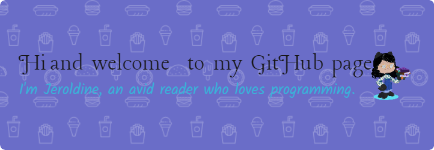

---

### :woman_technologist: About Me :
- 👋 Hi, I’m Jeroldine Oakley.
- 👀 I’m interested in machine learning, artificial intelligence, and data analytics.
- 🌱 I’m currently learning Python and Java.
- 💞️ I’m looking to collaborate on any projects and ready to learn.
- 📫 How to reach me: You can reach me through my socials below.

  
  

---

### :hammer_and_wrench: Languages and Tools :

  &nbsp;
  &nbsp;
  &nbsp;
  &nbsp;
  

---

### :fire: My Stats :

<!---

    

--->

  

<!---

--->

<!---
JayOaks/JayOaks is a ✨ special ✨ repository because its `README.md` (this file) appears on your GitHub profile.
I'm trying to see if the Holopin Board is updated.
Added widgets from Quine
Turned the Vaunt widget into a comment
Adding a header image to profile README
You can click the Preview link to take a look at your changes.
--->
